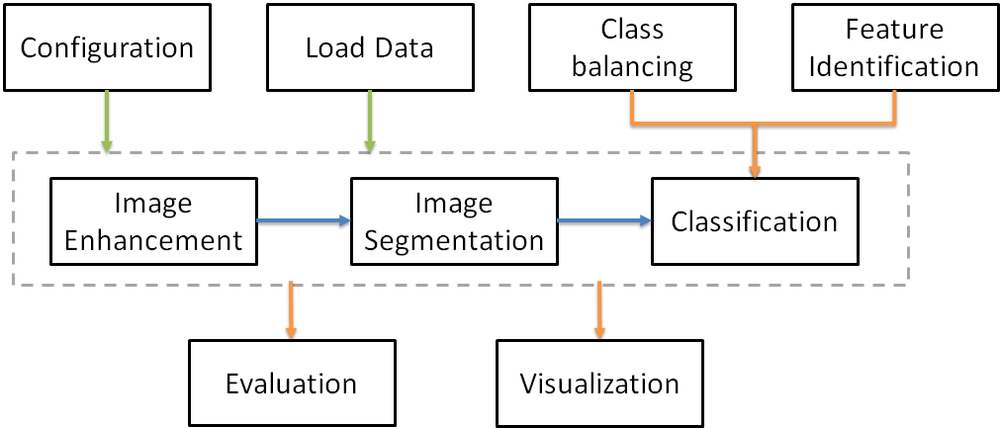

# Under-Water-Image-Classifier
###### Author: Aya Saad
###### Date created: 29 September 2019
A Modularized implementation for
Image enhancement, segmentation, classification, evaluation and visualization
Integrating all the algorithms stated above in one framework

---------------------------------------------------
<!-- -->

###Installation
    ## Create a conda environment
    conda create -n <environment name> pip python scikit-image pandas seaborn numpy matplotlib scikit-learn scipy
    ex: conda create -n clustering pip python scikit-image pandas seaborn numpy matplotlib scikit-learn scipy
    
    ## Activate the conda environment
    activate <environment name>
    activate classifier

    ## Install tensorflow
    conda install --yes -c conda-forge tensorflow 

    ## install keras  
    conda install --yes -c anaconda keras 

    ## install tflearn
    pip install tflearn h5py

---------------------------------------------------

###Usage

    python main.py [--output-dir output_directory_name] [--data-dir data_directory_name]
    
    Path options:
    
    --data_dir        # Directory where data is stored
    --output_dir      # Directory where output is stored
    --model_dir       # Directory where the trained model is stored
    --plot_dir        # Directory where plots are stored  
    
    Mode options:
    --random_seed    # to ensure reproducibility

---------------------------------------------------

###Models and performance

Information about the models and their performance can be found under the model directory

